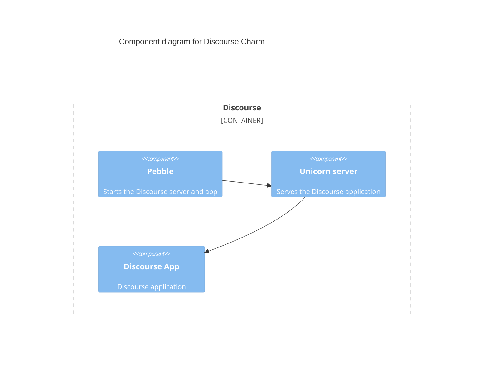
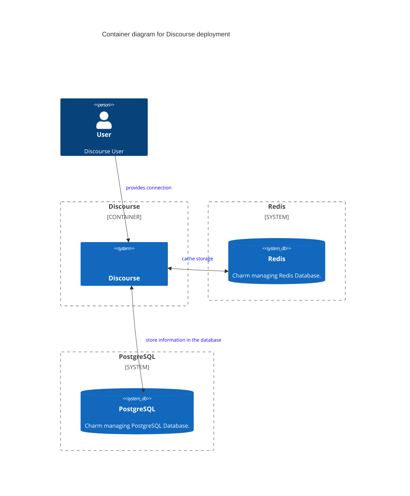

# Charm architecture

At its core, [Discourse](https://www.discourse.org/) is a [Ruby on Rails](https://rubyonrails.org/) application that integrates with [PostgreSQL](https://www.postgresql.org/) and [Redis](https://redis.io/).

The charm design leverages the [sidecar](https://kubernetes.io/blog/2015/06/the-distributed-system-toolkit-patterns/#example-1-sidecar-containers) pattern to allow multiple containers in each pod with [Pebble](https://juju.is/docs/sdk/pebble) running as the workload container’s entrypoint.

Pebble is a lightweight, API-driven process supervisor that is responsible for configuring processes to run in a container and controlling those processes throughout the workload lifecycle.

Pebble `services` are configured through [layers](https://github.com/canonical/pebble#layer-specification), and the following containers represent each one a layer forming the effective Pebble configuration, or `plan`:

1. A [Discourse](https://www.discourse.org/) container, consisting of a [Unicorn server](https://devcenter.heroku.com/articles/rails-unicorn) running the Discourse application along with the installed plugins.

As a result, if you run a `kubectl get pods` on a namespace named for the Juju model you've deployed the Discourse charm into, you'll see something like the following:

```bash
NAME                            READY   STATUS    RESTARTS   AGE
discourse-k8s-0                 2/2     Running   0          65m
```

This shows there are two containers - the one named above, as well as a container for the charm code itself.

And if you run `kubectl describe pod discourse-k8s-0`, all the containers will have as Command ```/charm/bin/pebble```. That's because Pebble is responsible for the processes startup as explained above.

## Charm architecture diagram



## High-level overview of a Discourse deployment

Below is a diagram of a basic Discourse deployment. It consists of three charms
deployed on a Kubernetes cloud: the Discourse charm, the Redis charm, and the
PostgreSQL charm.




## Containers

Configuration files for the workload can be found [here](https://github.com/canonical/discourse-k8s-operator/blob/main/config.yaml).

### Discourse

Discourse is a Ruby on Rails application deployed on top of the [Unicorn server](https://devcenter.heroku.com/articles/rails-unicorn).

The server is started in HTTP mode (port `3000`) serving all the content. Alongside it there's a standalone process running the [Prometheus Exporter Plugin for Discourse](https://github.com/discourse/discourse-prometheus) (port `9394`).

The workload that this container is running is defined in the [Discourse rock file in the charm repository](https://github.com/canonical/discourse-k8s-operator/blob/main/discourse_rock/rockcraft.yaml).

## OCI images

The OCI image is built using [Rockcraft](https://canonical-rockcraft.readthedocs-hosted.com) and defined in the [rock file](https://github.com/canonical/discourse-k8s-operator/blob/main/discourse_rock/rockcraft.yaml) in the charm repository. It is then published to [Charmhub](https://charmhub.io/), the official repository for charms.

This is done by publishing a resource to Charmhub as described in the [Juju SDK How-to guides](https://juju.is/docs/sdk/publishing).

## Integrations

This section provides information about the integrations.

### Ingress

The Discourse charm also supports being integrated with [Ingress](https://kubernetes.io/docs/concepts/services-networking/ingress/#what-is-ingress) by using [NGINX Ingress Integrator](https://charmhub.io/nginx-ingress-integrator/).

In this case, an existing Ingress controller is required. For more information, see [Adding the Ingress Relation to a Charm](https://charmhub.io/nginx-ingress-integrator/docs/add-the-nginx-route-relation).

### PostgreSQL

PostgreSQL is an open-source object-relational database used by Discourse to store all the data needed.

### Redis

Redis is an open-source in-memory data structure store used as a cache backend. Copies of frequently accessed data are stored and used if satisfy the request. Otherwise, the application will handle it. This configuration helps to reduce the number of queries and improve response latency.

### Grafana
Grafana is an open-source visualization tools that allows to query, visualize, alert on, and visualize metrics from mixed data sources in configurable dashboards for observability. This charms is shipped with its own Grafana dashboard and supports integration with the [Grafana Operator](https://charmhub.io/grafana-k8s) to simplify observability.

### Loki
Loki is an open-source fully-featured logging system. This charms is shipped with support for the [Loki Operator](https://charmhub.io/loki-k8s) to collect the generated logs.

### Prometheus
Prometheus is an open-source systems monitoring and alerting toolkit with a dimensional data model, flexible query language, efficient time series database and modern alerting approach. This charm is shipped with a Prometheus exporter, alerts and support for integrating with the [Prometheus Operator](https://charmhub.io/prometheus-k8s) to automatically scrape the targets.

## Juju events

Accordingly to the [Juju SDK](https://juju.is/docs/sdk/event): "an event is a data structure that encapsulates part of the execution context of a charm".

For this charm, the following events are observed:

1. [`<container name>_pebble_ready`](https://documentation.ubuntu.com/juju/3.6/reference/hook/#container-pebble-ready): fired on Kubernetes charms when the requested container is ready. Action: wait for the integrations, and configure the containers.
2. [`config_changed`](https://documentation.ubuntu.com/juju/3.6/reference/hook/#config-changed): usually fired in response to a configuration change using the GUI or CLI. Action: wait for the integrations, validate the configuration, update Ingress, and restart the containers.
3. [`add_admin_user_action`](https://charmhub.io/discourse-k8s/actions): fired when add-admin-user action is executed. Action: add an admin user with the provided email and password.
<!-- vale Canonical.400-Enforce-inclusive-terms = NO -->
<!-- master refers to the main database -->
4. [`database_relation_joined`](https://github.com/canonical/ops-lib-pgsql): PostgreSQLClient custom event for when the connection details to the master database on this relation joins. Action: initialize the database and enable the appropriate extensions.
5. [`master_changed`](https://github.com/canonical/ops-lib-pgsql): PostgreSQLClient custom event for when the connection details to the master database on this relation change. Action: update the database connection string configuration and emit `config_changed` event.
<!-- vale Canonical.400-Enforce-inclusive-terms = YES -->
6. [`redis_relation_updated`](https://github.com/canonical/redis-k8s-operator): Redis Operator custom event for when the relation details have been updated. Action: wait for the integrations and restart the containers.

## Charm code overview

The `src/charm.py` is the default entry point for a charm and has the DiscourseCharm Python class which inherits from CharmBase.

CharmBase is the base class from which all Charms are formed, defined by [Ops](https://juju.is/docs/sdk/ops) (Python framework for developing charms).

See more information in [Charm](https://documentation.ubuntu.com/juju/3.6/howto/manage-charms/#build-a-charm).

The `__init__` method guarantees that the charm observes all events relevant to its operation and handles them.
